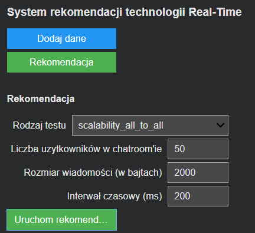
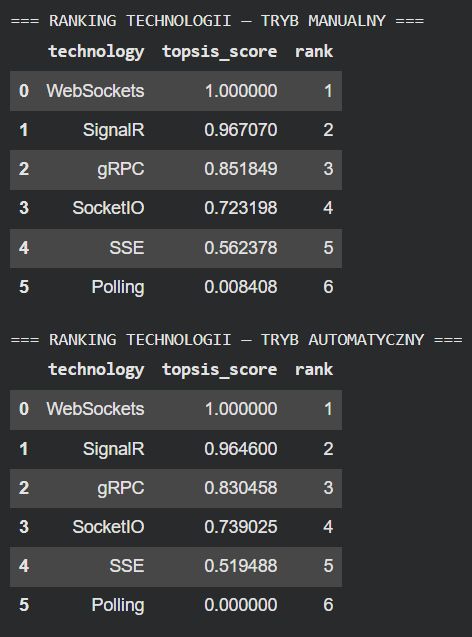
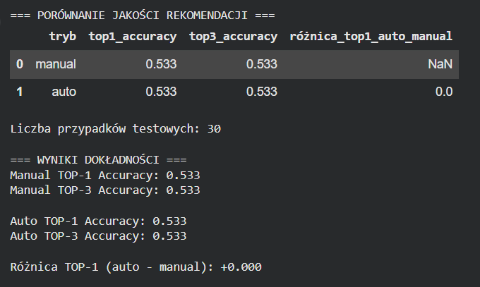
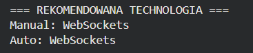
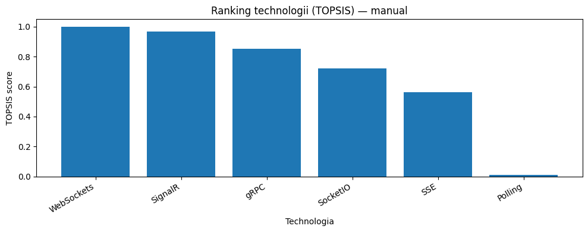
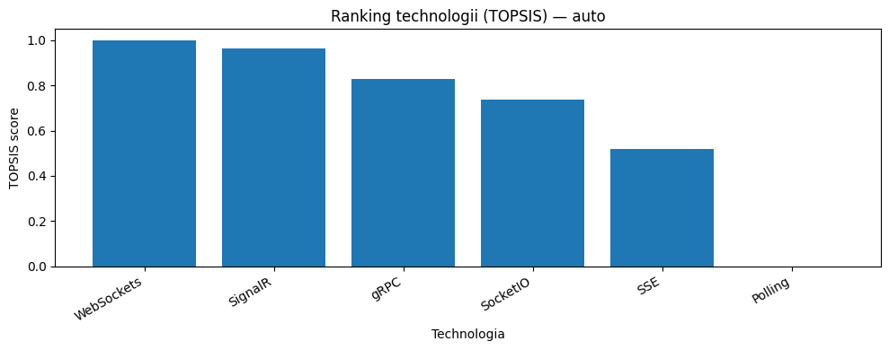

# RT Technology Recommendation System

The `RT_Technology_Recommendation_System.ipynb` notebook contains a decision support system for selecting a real-time communication technology for a web application. The system recommends a Real-Time technology based on test scenario parameters and historical performance measurement results.

The solution uses a hybrid approach:

- **CBR (Case-Based Reasoning)** - finds historical cases that are most similar to the scenario provided by the user.
- **TOPSIS** - ranks technologies using multi-criteria analysis based on performance and resource usage metrics.

## Directory Contents

- `RT_Technology_Recommendation_System.ipynb` - the main Google Colab notebook with data analysis, the recommendation model, and an interactive form.
- `rt_technology_recommendation_system.py` - Python export of the notebook code.
- `results.csv` - performance test results used as the CBR case base.

## System Goal

The goal of the system is to indicate the most suitable Real-Time communication technology for a given application scenario. The recommendation is based on load parameters such as the number of users, the number of chat rooms, message size, message sending frequency, and test type.

Analyzed technologies:

- SignalR
- WebSockets
- SSE
- Polling
- Socket.IO
- gRPC

## Input Data

The dataset describes test scenarios and measurement results for individual technologies. The most important columns are:

- `test_type` - performance test type, for example scalability, throughput, spike, or endurance.
- `technology` - tested real-time communication technology.
- `users_chatroom` - number of users in a chat room.
- `users_server` - total number of users generating load on the server.
- `chatrooms` - number of simultaneously active chat rooms.
- `senders_per_chat_ratio` - ratio of users sending messages.
- `payload_size_bytes` - size of a single message.
- `interval_ms` - message sending interval.
- `avg_message_time_ms`, `min_message_time_ms`, `max_message_time_ms` - message delivery time metrics.
- `throughput` - throughput measured in messages per second.
- `error_rate` - ratio of failed or unhandled messages.
- `cpu_avg`, `cpu_max`, `ram_avg`, `ram_max` - resource usage metrics.

## Recommendation Workflow

1. The notebook loads data from `results.csv`.
2. The data is cleaned and prepared for analysis.
3. Numerical features are standardized, and categorical features are encoded using One-Hot Encoding.
4. The CBR module calculates similarity between the user scenario and historical cases.
5. The most similar cases are aggregated at the technology level.
6. TOPSIS creates a ranking of technologies based on quality metrics.
7. The system returns the best technology and a ranked list of alternatives.

## CBR

The CBR module uses weighted Euclidean distance. The smaller the distance between scenarios, the higher the similarity between a historical case and the user query.

The system supports two feature weighting modes:

- manual - expert-defined weights,
- automatic - weights selected with random search for test groups.

The `test_type` feature has the highest importance because it determines the nature of the system load. User count and chat room count parameters are also highly significant.

## TOPSIS

TOPSIS compares technologies against an ideal and an anti-ideal solution. The criteria include latency, throughput, errors, CPU usage, and RAM usage.

The system supports two criteria weighting modes:

- manual - weights dependent on the test type,
- automatic - weights calculated using the entropy weighting method.

For throughput tests, `throughput` has the highest importance. For scalability, spike, and endurance tests, latency, errors, and resource stability play a larger role.

## How to Run

The notebook is prepared for Google Colab.

1. Open `RT_Technology_Recommendation_System.ipynb` in Google Colab.
2. Mount Google Drive.
3. Make sure `results.csv` is available at the path used in the notebook, or upload it during execution.
4. Run the cells from top to bottom.
5. Use the recommendation form to enter scenario parameters and generate the technology ranking.

## Libraries

The notebook uses, among others:

- `numpy`
- `pandas`
- `matplotlib`
- `seaborn`
- `scikit-learn`
- `ipywidgets`

## Output

The system returns:

- recommended Real-Time technology,
- TOPSIS technology ranking,
- similar historical cases found by CBR,
- criteria and weights used in the recommendation,
- visualizations of rankings and metrics.

## Screenshots

The screenshots below present an example recommendation generated by the notebook for a selected Real-Time communication scenario.

### Example Input Scenario

The recommendation form allows the user to define the workload and communication parameters used by the CBR module to search for similar historical cases.

Example scenario:

- `test_type`: `scalability_all_to_all`
- `users_chatroom`: `50`
- `payload_size_bytes`: `2000`
- `interval_ms`: `200`

### Recommendation Summary

The system compares the manual and automatic variants of the hybrid CBR + TOPSIS model and returns the recommended technology for each mode.

### Recommendation Quality

The notebook also displays the quality of the recommendation process, including the accuracy achieved by automatic CBR weight tuning for the selected test group.

### Recommended Technologies

This view summarizes the technologies selected as the best alternatives by the manual and automatic recommendation modes.

### TOPSIS Ranking - Manual Mode

### TOPSIS Ranking - Automatic Mode

